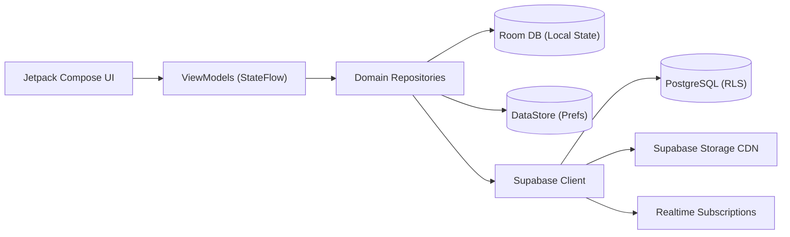
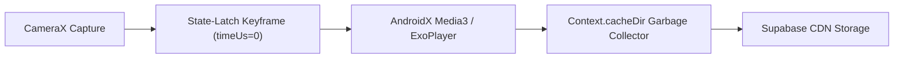

<div align="center">

  <!-- Glassmorphic Liquid Hero Banner Header -->
  <br />
  <p align="center">
    
  </p>

  <h1 align="center">
    <b><code>PALZEE Android</code></b>
  </h1>

  <p align="center">
    <b>Next-Generation Private Micro-Vlogging & Video Pals Platform</b>
  </p>

  <p align="center">
    <i>Native Android application delivering authentic, zero-algorithm daily moment sharing for your inner circle.</i>
  </p>

  <!-- Badges Grid (Square Icons Only) -->
  <p align="center">
    <a href="https://palzee.fun/" title="Live Website">
      
    </a>
    <a href="https://github.com/asurxeth/PALZEE-ANDROID" title="GitHub Repository">
      
    </a>
    <a href="https://developer.android.com/kotlin" title="Kotlin">
      
    </a>
    <a href="https://developer.android.com/jetpack/compose" title="Jetpack Compose">
      
    </a>
    <a href="https://palzee.fun/csampolicy.html" title="CSAM Zero Tolerance Policy">
      
    </a>
  </p>

</div>

<br />

<div align="center">
  <table width="100%" style="border-collapse: collapse; border: none;">
    <tr>
      <td align="center" style="background: linear-gradient(135deg, rgba(99, 102, 241, 0.08) 0%, rgba(168, 85, 247, 0.08) 50%, rgba(236, 72, 153, 0.08) 100%); border-radius: 20px; padding: 24px; border: 1px solid rgba(255, 255, 255, 0.2);">
        <h3>📱 Native Jetpack Compose · ⚡ Zero-Latency State-Latch Keyframes · 🌊 Liquid UX</h3>
        <p>Built by <b>Fin Rein Inc.</b> (Kanpur & Lucknow) for trusted, private social video connections.</p>
      </td>
    </tr>
  </table>
</div>

---

## ✨ Features & Architecture

<div align="center">
<table>
  <tr>
    <td width="50%" valign="top">
      <h3>🚀 Zero-Latency Local-First Engine</h3>
      <ul>
        <li><b>State-Latch Keyframe Engine:</b> Instant pre-rendering of video snapshots using <code>MediaMetadataRetriever</code> at <code>timeUs = 0</code> to eliminate preview lag.</li>
        <li><b>CameraX 1.4.2 Pipeline:</b> Hardware-accelerated capturing utilizing <code>Camera2</code>, <code>Lifecycle</code>, and high-framerate <code>VideoRecord</code>.</li>
        <li><b>Algorithmic Storage GC:</b> Internal Garbage Collector continuously purges temporary video clips in <code>Context.cacheDir</code> to preserve device performance.</li>
        <li><b>AndroidX Media3 ExoPlayer:</b> Low-latency video streaming with custom aspect-ratio fitting and silent fallback controls.</li>
      </ul>
    </td>
    <td width="50%" valign="top">
      <h3>🔒 Security, Privacy & Safety</h3>
      <ul>
        <li><b>Zero-Algorithm Feed:</b> No addictive feed algorithms or tracking—content is visible exclusively to your designated circle ("My Pals").</li>
        <li><b>Supabase Auth & PostgreSQL:</b> Secure JWT-authenticated user sessions (<code>io.supabase.pals</code>) with Row-Level Security (RLS).</li>
        <li><b>CSAM/CSAE Zero Tolerance:</b> Media hashes are verified against safety registries via Supabase Edge Functions before distribution.</li>
        <li><b>Real-Time Push Notifications:</b> Instant FCM push alerts for daily moment sharing and friend updates.</li>
      </ul>
    </td>
  </tr>
</table>
</div>

---

## 🏗️ Architecture & Data Flow

### Application State & Data Flow


### Media Capture & Playback Pipeline


---

## 🛠️ Technology Stack Matrix

```ascii
 📱 PALZEE ANDROID SYSTEM
 ├── 🎨 UI & Design          : Jetpack Compose · Material3 · Custom Silhouette Layouts
 ├── ⚡ Language & Runtime   : Kotlin 2.0+ · JVM 17 Target · Coroutines & Flow
 ├── 📷 Camera & Media       : CameraX 1.4.2 · AndroidX Media3 ExoPlayer · MediaMetadataRetriever
 ├── 💾 Local Persistence   : Room Database · Preferences DataStore
 ├── 🔐 Backend Services     : Supabase Auth · Supabase Realtime · Supabase Storage CDN
 └── 🔔 Cloud Messaging      : Firebase Cloud Messaging (FCM) · Android Notifications
```

---

## 📁 Repository Structure

```structure
app
├── src/main/java/io/supabase/pals/
│   ├── core/                           # Common UI components, themes, design tokens & navigation
│   │   ├── designsystem/               # Liquid typography, colors, dynamic theme adapters
│   │   └── network/                    # Supabase client & API services
│   ├── feature/                        # Feature-driven modular packages
│   │   ├── auth/                       # Sign in, registration, passkey & email flows
│   │   ├── camera/                     # CameraX viewfinder & instant moment capture
│   │   ├── chat/                       # Real-time private messaging & video reactions
│   │   ├── home/                       # Daily moments timeline & friend feed
│   │   └── pals/                       # Friends circle management & profile setup
│   ├── services/                       # Background sync workers & FCM NotificationService
│   └── utils/                          # Media GC, keyframe extractors & system helpers
└── build.gradle.kts                    # App-level Gradle dependencies & custom tasks
```

---

## 🚀 Getting Started

### Prerequisites
- **Android Studio:** Ladybug (2024.2.1+) or newer
- **JDK:** Java Development Kit 17+
- **Android SDK:** API 24+ (Android 7.0) minimum, API 35 target

### Installation & Build

1. **Clone the repository:**
   ```bash
   git clone https://github.com/asurxeth/PALZEE-ANDROID.git
   cd PALZEE-ANDROID
   ```

2. **Setup environment variables:**
   Ensure `.env` or `local.properties` contains your Supabase credentials:
   ```properties
   SUPABASE_URL=https://your-supabase-project.supabase.co
   SUPABASE_ANON_KEY=your-supabase-anon-key
   ```

3. **Build Debug APK:**
   ```bash
   ./gradlew assembleDebug
   ```

4. **Run ADB Logcat Diagnostics (Custom Gradle Tasks):**
   ```bash
   # Extract application crash logs
   ./gradlew readCrash

   # Stream real-time logcat output to logcat_real.txt
   ./gradlew readLogcat
   ```

---

## 📬 Contact & Legal

- **Company:** Fin Rein Inc. (Kanpur & Lucknow, UP, India)
- **Primary Support:** [pratham@palzee.fun](mailto:pratham@palzee.fun)
- **Web App & Policies:** [https://palzee.fun](https://palzee.fun/)

---

<div align="center">
  <p>© 2026 <b>Fin Rein Inc.</b> · All Rights Reserved.</p>
</div>
