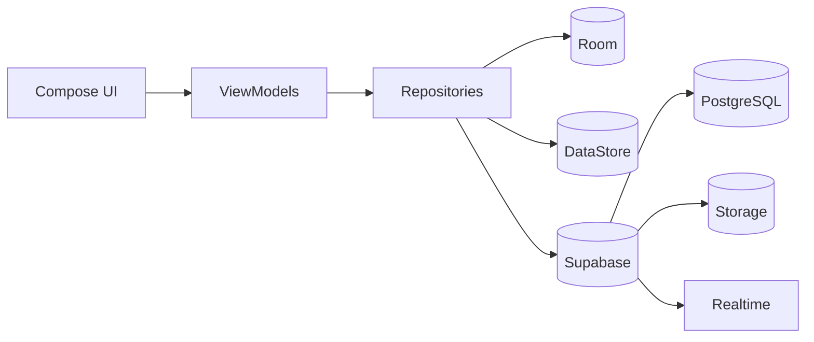
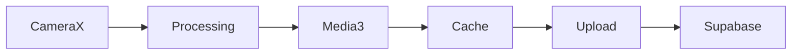

<div align="center">

# PALZEE

### Next-generation private social platform

**Privacy-first • Native Android • Local-first • Realtime**


> **Building meaningful relationships—not endless scrolling.**

</div>

---

## Why PALZEE?

PALZEE is an Android-first social platform focused on **privacy**, **trusted communities**, and **user control**. Instead of maximizing engagement through algorithms, it prioritizes authentic sharing, native performance, and a distraction-free experience.

---

## Architecture



---

## Media Flow



---

## Tech Stack

| Android | Backend | Tools |
|----------|---------|-------|
| Kotlin | Supabase | Gradle |
| Jetpack Compose | PostgreSQL | Git |
| CameraX | Storage | Android Studio |
| Media3 | Realtime | Firebase |

---

## Project Structure

```text
app
├── core
├── feature
│   ├── auth
│   ├── camera
│   ├── chat
│   ├── home
│   └── pals
├── services
└── utils
```

---

## Getting Started

```bash
git clone https://github.com/asurxeth/PALZEE.git
cd PALZEE
./gradlew assembleDebug
```

For architecture, backend, deployment and release details, see the **/docs** directory.

---

<div align="center">

⭐ **Star the repository if you like the project.**

Building the future of **private social networking**.

</div>
