# Compose State Mutation & Ownership Audit

## 1. Inventory of Mutable States

| Variable Name | Type | Approximate Line | Current Owner | Who Reads It | Who Writes It | Target Location |
| --- | --- | --- | --- | --- | --- | --- |
| `N/A` | `Any` | 505 | `Global/File` | N/A | N/A | **ViewModel** |
| `N/A` | `Any` | 526 | `Global/File` | N/A | N/A | **ViewModel** |
| `imageBitmap` | `androidx.compose.ui.graphics.ImageBitmap?` | 539 | `UriImage` | UriImage (L572), UriImage (L574) | UriImage (L565) | **ViewModel** |
| `onboardingFlowStep` | `Unknown` | 1102 | `HomeScreen` | HomeScreen (L1101), HomeScreen (L1167), HomeScreen (L1168... | HomeScreen (L1250), HomeScreen (L1330), HomeScreen (L1334... | **ViewModel** |
| `onboardingFirstName` | `Inferred (parsedName.first)` | 1115 | `HomeScreen` | OnboardingFlowContainer (L1042), OnboardingFlowContainer ... | refreshMessages (L2889), refreshMessages (L2890) | **ViewModel** |
| `onboardingLastName` | `Inferred (parsedName.second)` | 1116 | `HomeScreen` | OnboardingFlowContainer (L1044), OnboardingFlowContainer ... | refreshMessages (L2891), refreshMessages (L2892) | **ViewModel** |
| `currentDisplayName` | `Inferred (user?.displayName ?: user?.email?.substringBefore("@") ?: "apple_user")` | 1119 | `HomeScreen` | CapturedPreviewScreen (L5948), CapturedPreviewScreen (L60... | GroupScreenContent (L7650), GroupScreenContent (L7714), G... | **ViewModel** |
| `editFirstName` | `String` | 1126 | `HomeScreen` | EditNameDialogOverlay (L13469), EditNameDialogOverlay (L1... | refreshMessages (L2739), refreshMessages (L3896), refresh... | **ViewModel** |
| `editLastName` | `String` | 1127 | `HomeScreen` | EditNameDialogOverlay (L13471), EditNameDialogOverlay (L1... | refreshMessages (L2740), refreshMessages (L3898), refresh... | **ViewModel** |
| `customAvatarUriString` | `Inferred (sessionManager.getAvatarUri())` | 1130 | `HomeScreen` | CapturedPreviewScreen (L5950), CapturedPreviewScreen (L60... | GroupScreenContent (L7654), GroupScreenContent (L7718), G... | **ViewModel** |
| `isLoadingPals` | `Inferred (sessionManager.isFirstLogin())` | 1147 | `HomeScreen` | PalsTabScreenContent (L14515) | HomeScreen (L1207), HomeScreen (L1209), HomeScreen (L1212... | **ViewModel** |
| `selectedTab` | `String` | 1148 | `HomeScreen` | HomeScreen (L1191), HomeScreen (L1192), HomeScreen (L1205... | onOrientationChanged (L1875), onOrientationChanged (L1877... | **ViewModel** |
| `isRecordingCamera` | `Boolean` | 1149 | `HomeScreen` | onMediaItemTransition (L1838), onMediaItemTransition (L18... | refreshMessages (L3680) | **ViewModel** |
| `showPlusMenu` | `Boolean` | 1216 | `HomeScreen` | PlusMenuOverlay (L13034), PlusMenuOverlay (L13043), onMed... | refreshMessages (L3516), refreshMessages (L3729), refresh... | **ViewModel** |
| `showTripleDotMenu` | `Boolean` | 1217 | `HomeScreen` | TripleDotMenuOverlay (L13993), TripleDotMenuOverlay (L140... | getEpoch (L8358), onPlaybackStateChanged (L8800), onPlayb... | **ViewModel** |
| `showActivityScreen` | `Boolean` | 1218 | `HomeScreen` | ActivityScreenOverlay (L13112), ActivityScreenOverlay (L1... | refreshMessages (L3780), refreshMessages (L3781) | **ViewModel** |
| `showCreatePalFlow` | `Boolean` | 1219 | `HomeScreen` | CreatePalDialogOverlay (L13678), CreatePalDialogOverlay (... | refreshMessages (L3739), refreshMessages (L3789), refresh... | **ViewModel** |
| `showJoinPalFlow` | `Boolean` | 1220 | `HomeScreen` | JoinPalDialogOverlay (L13171), JoinPalDialogOverlay (L131... | refreshMessages (L3743), refreshMessages (L3873), refresh... | **ViewModel** |
| `createPalTitleVisible` | `Boolean` | 1226 | `HomeScreen` | N/A | HomeScreen (L1232), HomeScreen (L1241) | **ViewModel** |
| `createPalInputVisible` | `Boolean` | 1227 | `HomeScreen` | N/A | HomeScreen (L1234), HomeScreen (L1242) | **ViewModel** |
| `createPalSizeVisible` | `Boolean` | 1228 | `HomeScreen` | N/A | HomeScreen (L1236), HomeScreen (L1243) | **ViewModel** |
| `createPalStep` | `Int` | 1352 | `HomeScreen` | CreatePalDialogOverlay (L13682), CreatePalDialogOverlay (... | HomeScreen (L1377), refreshMessages (L3738), refreshMessa... | **ViewModel** |
| `newPalName` | `String` | 1353 | `HomeScreen` | CreatePalDialogOverlay (L13684), CreatePalDialogOverlay (... | refreshMessages (L3736), refreshMessages (L3795), refresh... | **ViewModel** |
| `newPalSize` | `String` | 1354 | `HomeScreen` | CreatePalDialogOverlay (L13686), CreatePalDialogOverlay (... | refreshMessages (L3737), refreshMessages (L3797), refresh... | **ViewModel** |
| `generatedPalCode` | `String` | 1355 | `HomeScreen` | CreatePalDialogOverlay (L13688), CreatePalDialogOverlay (... | HomeScreen (L1364), refreshMessages (L3799) | **ViewModel** |
| `joinPalCode` | `String` | 1356 | `HomeScreen` | JoinPalDialogOverlay (L13173), JoinPalDialogOverlay (L133... | refreshMessages (L3742), refreshMessages (L3875), refresh... | **ViewModel** |
| `isCreatingPal` | `Boolean` | 1358 | `HomeScreen` | CreatePalDialogOverlay (L13680), CreatePalDialogOverlay (... | HomeScreen (L1378), refreshMessages (L3791), refreshMessa... | **ViewModel** |
| `creationDots` | `String` | 1359 | `HomeScreen` | CreatePalDialogOverlay (L13689), CreatePalDialogOverlay (... | HomeScreen (L1368), HomeScreen (L1370), HomeScreen (L1372... | **ViewModel** |
| `N/A` | `Any` | 1400 | `HomeScreen` | N/A | N/A | **ViewModel** |
| `selectedThemeColor` | `String` | 1415 | `HomeScreen` | CameraScreenContent (L4730), CameraScreenContent (L4740),... | refreshMessages (L3675), refreshMessages (L3759), refresh... | **ViewModel** |
| `tripleDotScreen` | `Inferred (TripleDotScreen.MAIN)` | 1465 | `HomeScreen` | TripleDotMenuOverlay (L13995), TripleDotMenuOverlay (L140... | refreshMessages (L3519), refreshMessages (L3751), refresh... | **ViewModel** |
| `showEditNameDialog` | `Boolean` | 1466 | `HomeScreen` | EditNameDialogOverlay (L13463), EditNameDialogOverlay (L1... | refreshMessages (L3772), refreshMessages (L3890), refresh... | **ViewModel** |
| `notificationInterval` | `String` | 1467 | `HomeScreen` | TripleDotMenuOverlay (L14005), TripleDotMenuOverlay (L14391) | refreshMessages (L3761), refreshMessages (L3762) | **ViewModel** |
| `userPin` | `String` | 1468 | `HomeScreen` | N/A | N/A | **ViewModel** |
| `activeVlogPal` | `PalItem?` | 1471 | `HomeScreen` | CapturedPreviewScreen (L5940), clearGroupMemoryCaches (L1... | refreshMessages (L2486), refreshMessages (L2488), refresh... | **ViewModel** |
| `isStateRestoredRef` | `Boolean` | 1472 | `HomeScreen` | refreshMessages (L2501) | refreshMessages (L2495) | **ViewModel** |
| `showingCapturedPreview` | `Boolean` | 1473 | `HomeScreen` | onMediaItemTransition (L1775), onMediaItemTransition (L18... | refreshMessages (L3332), refreshMessages (L3483), refresh... | **ViewModel** |
| `capturedVideoPath` | `String?` | 1474 | `HomeScreen` | CapturedPreviewScreen (L5943), CapturedPreviewScreen (L59... | refreshMessages (L3330), refreshMessages (L3683) | **ViewModel** |
| `capturedVideoDuration` | `Inferred (2000L)` | 1475 | `HomeScreen` | refreshMessages (L2642), refreshMessages (L3375), refresh... | refreshMessages (L3684) | **ViewModel** |
| `capturedCaptionText` | `String` | 1476 | `HomeScreen` | refreshMessages (L2642) | refreshMessages (L3335) | **ViewModel** |
| `capturedVideoTimeText` | `String` | 1477 | `HomeScreen` | N/A | refreshMessages (L3338) | **ViewModel** |
| `isMuted` | `Boolean` | 1478 | `HomeScreen` | CapturedPreviewScreen (L5953), CapturedPreviewScreen (L61... | onPlaybackStateChanged (L6366), onPlaybackStateChanged (L... | **ViewModel** |
| `initialSyncCompleted` | `Boolean` | 1479 | `HomeScreen` | refreshMessages (L2389) | refreshMessages (L2428) | **ViewModel** |
| `filteredPathsList` | `Inferred (ArrayList(filteredPathsList))` | 1490 | `HomeScreen` | N/A | HomeScreen (L1489) | **ViewModel** |
| `filteredTimesList` | `Inferred (ArrayList(filteredTimesList))` | 1499 | `HomeScreen` | N/A | HomeScreen (L1498) | **ViewModel** |
| `filteredCaptionsList` | `Inferred (ArrayList(filteredCaptionsList))` | 1508 | `HomeScreen` | N/A | HomeScreen (L1507) | **ViewModel** |
| `filteredDurationsList` | `Inferred (ArrayList(filteredDurationsList))` | 1517 | `HomeScreen` | N/A | HomeScreen (L1516) | **ViewModel** |
| `currentPlayingIndex` | `Int` | 1519 | `HomeScreen` | PalsTabScreenContent (L14520), getEpoch (L8463), getEpoch... | PalsTabScreenContent (L14549), VlogScreenContent (L8038),... | **ViewModel** |
| `vlogPlaybackProgress` | `Float` | 1520 | `HomeScreen` | PalsTabScreenContent (L14523), onPlaybackStateChanged (L6... | PalsTabScreenContent (L14552), VlogScreenContent (L8039),... | **UI** |
| `showVlogDropdownMenu` | `Boolean` | 1521 | `HomeScreen` | onMediaItemTransition (L1835), onMediaItemTransition (L18... | refreshMessages (L2751), refreshMessages (L2926) | **ViewModel** |
| `showVlogChatScreen` | `Boolean` | 1522 | `HomeScreen` | onMediaItemTransition (L1836), onMediaItemTransition (L18... | refreshMessages (L2749), refreshMessages (L2928), refresh... | **ViewModel** |
| `showEditPalFlow` | `Boolean` | 1523 | `HomeScreen` | onMediaItemTransition (L1837), onMediaItemTransition (L18... | refreshMessages (L2726), refreshMessages (L2753), refresh... | **ViewModel** |
| `showDeletePalDialog` | `Boolean` | 1524 | `HomeScreen` | onMediaItemTransition (L1832), onMediaItemTransition (L18... | refreshMessages (L2755), refreshMessages (L2938) | **ViewModel** |
| `showLeavePalDialog` | `Boolean` | 1525 | `HomeScreen` | onMediaItemTransition (L1833), onMediaItemTransition (L18... | refreshMessages (L2757), refreshMessages (L2940) | **ViewModel** |
| `showVlogExportDialog` | `Boolean` | 1526 | `HomeScreen` | onMediaItemTransition (L1776), onMediaItemTransition (L18... | refreshMessages (L2942) | **ViewModel** |
| `selectedDayOffset` | `Int` | 1535 | `HomeScreen` | clearGroupMemoryCaches (L1590), clearGroupMemoryCaches (L... | VlogScreenContent (L8044), refreshMessages (L2909), refre... | **ViewModel** |
| `activeHourSubmissions` | `Map<String, SubmissionDbItem` | 1537 | `HomeScreen` | N/A | clearGroupMemoryCaches (L1543), clearGroupMemoryCaches (L... | **ViewModel** |
| `dailyHourHistoryMap` | `Map<Int, List<SubmissionDbItem` | 1538 | `HomeScreen` | refreshActivePalDetails (L2227), refreshActivePalDetails ... | clearGroupMemoryCaches (L1544), clearGroupMemoryCaches (L... | **ViewModel** |
| `exportMenuDataState` | `Map<Int, List<SubmissionDbItem` | 1539 | `HomeScreen` | N/A | clearGroupMemoryCaches (L1546), clearGroupMemoryCaches (L... | **ViewModel** |
| `activeGroupMembersList` | `List<UserItem` | 1540 | `HomeScreen` | N/A | clearGroupMemoryCaches (L1573) | **ViewModel** |
| `activeReplyPreviewPath` | `String?` | 1587 | `HomeScreen` | ReplyPreviewOverlay (L12048), ReplyPreviewOverlay (L12054... | VlogScreenContent (L8051), onPlaybackStateChanged (L10131... | **ViewModel** |
| `activeReactionPreview` | `Pair<String, String` | 1588 | `HomeScreen` | ReactionPreviewOverlay (L12197), ReactionPreviewOverlay (... | VlogScreenContent (L8053), onPlaybackStateChanged (L10140... | **ViewModel** |
| `lastPhysicalIsRotated` | `Boolean?` | 1820 | `HomeScreen` | onMediaItemTransition (L1840), onOrientationChanged (L187... | onOrientationChanged (L1880) | **ViewModel** |
| `isRefreshing` | `Boolean` | 1896 | `HomeScreen` | N/A | refreshPals (L1902), refreshPals (L1945) | **ViewModel** |
| `isCapturingPal` | `Boolean` | 2563 | `HomeScreen` | refreshMessages (L2572), refreshMessages (L2573), refresh... | refreshMessages (L2681), refreshMessages (L2922) | **ViewModel** |
| `capturingProgress` | `Float` | 2564 | `HomeScreen` | refreshMessages (L2924) | refreshMessages (L2574), refreshMessages (L2579) | **ViewModel** |
| `vlogMenuExpandedMembers` | `Boolean` | 2565 | `HomeScreen` | refreshMessages (L2943) | refreshMessages (L2944) | **ViewModel** |
| `vlogMenuExpandedSettings` | `Boolean` | 2566 | `HomeScreen` | refreshMessages (L2945) | refreshMessages (L2946) | **ViewModel** |
| `editPalName` | `String` | 2567 | `HomeScreen` | refreshMessages (L2700), refreshMessages (L2702), refresh... | refreshMessages (L2933), refreshMessages (L2948) | **ViewModel** |
| `editPalSize` | `String` | 2568 | `HomeScreen` | refreshMessages (L2702), refreshMessages (L2713), refresh... | refreshMessages (L2934), refreshMessages (L2950) | **ViewModel** |
| `isEditingPalLoading` | `Boolean` | 2569 | `HomeScreen` | refreshMessages (L2685), refreshMessages (L2686), refresh... | refreshMessages (L2725), refreshMessages (L2952) | **ViewModel** |
| `editPalDots` | `String` | 2570 | `HomeScreen` | refreshMessages (L2953) | refreshMessages (L2689), refreshMessages (L2691), refresh... | **ViewModel** |
| `plusMenuBounds` | `Rect?` | 2731 | `HomeScreen` | N/A | N/A | **UI** |
| `tripleDotMenuBounds` | `Rect?` | 2732 | `HomeScreen` | N/A | refreshMessages (L3775) | **UI** |
| `joinPalBounds` | `Rect?` | 2733 | `HomeScreen` | N/A | N/A | **UI** |
| `editNameBounds` | `Rect?` | 2734 | `HomeScreen` | refreshMessages (L3694) | refreshMessages (L3901) | **UI** |
| `screenCornerRadius` | `Dp` | 2768 | `HomeScreen` | refreshMessages (L2867), refreshMessages (L2869), refresh... | refreshMessages (L2831) | **UI** |
| `activeCamera` | `androidx.camera.core.Camera?` | 4648 | `CameraPreview` | CameraPreview (L4684), CameraPreview (L4685), CameraPrevi... | CameraPreview (L4677) | **UI** |
| `activeSlot` | `Int` | 4762 | `CameraScreenContent` | CameraScreenContent (L4962), CameraScreenContent (L4977),... | CameraScreenContent (L4980), CameraScreenContent (L5220) | **ViewModel** |
| `activeTimerMode` | `Inferred (TimerMode.DEFAULT)` | 4763 | `CameraScreenContent` | CameraScreenContent (L4809), CameraScreenContent (L4921),... | CameraScreenContent (L5320) | **ViewModel** |
| `flashMode` | `String` | 4764 | `CameraScreenContent` | CameraScreenContent (L4961), CameraScreenContent (L5271),... | CameraScreenContent (L5263) | **ViewModel** |
| `isCameraFlipped` | `Boolean` | 4765 | `CameraScreenContent` | CameraPreview (L4626), CameraPreview (L4650), CameraPrevi... | CameraScreenContent (L4960), CameraScreenContent (L5355) | **ViewModel** |
| `recordingProgress` | `Float` | 4766 | `CameraScreenContent` | CameraScreenContent (L5046), CameraScreenContent (L5287),... | CameraScreenContent (L4856), CameraScreenContent (L4861),... | **UI** |
| `countdownSeconds` | `Int` | 4767 | `CameraScreenContent` | CameraScreenContent (L4777), CameraScreenContent (L4778),... | CameraScreenContent (L4780), CameraScreenContent (L4924) | **ViewModel** |
| `videoCaptureRef` | `VideoCapture<Recorder` | 4768 | `CameraScreenContent` | CameraScreenContent (L4801) | CameraScreenContent (L4963) | **UI** |
| `activeRecordingSession` | `Recording?` | 4769 | `CameraScreenContent` | CameraScreenContent (L4773), CameraScreenContent (L4870) | CameraScreenContent (L4847), CameraScreenContent (L4865),... | **UI** |
| `initialTime` | `Inferred (String.format("%02d:%02d", initialTime.hour, initialTime.minute))` | 4789 | `CameraScreenContent` | N/A | CameraScreenContent (L4788) | **ViewModel** |
| `isMuted` | `Boolean` | 5953 | `CapturedPreviewScreen` | CapturedPreviewScreen (L6104), CapturedPreviewScreen (L61... | onPlaybackStateChanged (L6366), onPlaybackStateChanged (L... | **ViewModel** |
| `captionText` | `String` | 5954 | `CapturedPreviewScreen` | onPlaybackStateChanged (L6271), onPlaybackStateChanged (L... | onPlaybackStateChanged (L6272), onPlaybackStateChanged (L... | **ViewModel** |
| `isPreviewSaving` | `Boolean` | 5955 | `CapturedPreviewScreen` | onPlaybackStateChanged (L6386), onPlaybackStateChanged (L... | onPlaybackStateChanged (L6387), onPlaybackStateChanged (L... | **ViewModel** |
| `isPreviewSaved` | `Boolean` | 5956 | `CapturedPreviewScreen` | onPlaybackStateChanged (L6386), onPlaybackStateChanged (L... | onPlaybackStateChanged (L6408), onPlaybackStateChanged (L... | **ViewModel** |
| `selectedPals` | `Set<String` | 5973 | `CapturedPreviewScreen` | onPlaybackStateChanged (L6221), onPlaybackStateChanged (L... | onPlaybackStateChanged (L6565) | **ViewModel** |
| `showDropdownMenu` | `Boolean` | 6857 | `GroupMemberCard` | GroupMemberCard (L6989) | GroupMemberCard (L6978), GroupMemberCard (L6990), GroupMe... | **ViewModel** |
| `showEmojiOverlay` | `Boolean` | 6858 | `GroupMemberCard` | GroupMemberCard (L7113) | GroupMemberCard (L7041), GroupMemberCard (L7119), GroupMe... | **ViewModel** |
| `currentEmojis` | `Inferred (defaultEmojis.take(5))` | 6860 | `GroupMemberCard` | GroupMemberCard (L7127), PalChatOverlay (L12421), PalChat... | GroupMemberCard (L7145), PalChatOverlay (L12881) | **ViewModel** |
| `groupPosX` | `Float` | 7177 | `GroupMemberCard` | GroupMemberCard (L7200), GroupMemberCard (L7250), GroupMe... | GroupMemberCard (L7184), GroupMemberCard (L7234), GroupMe... | **UI** |
| `groupPosY` | `Float` | 7178 | `GroupMemberCard` | GroupMemberCard (L7201), GroupMemberCard (L7251), GroupMe... | GroupMemberCard (L7185), GroupMemberCard (L7235), GroupMe... | **UI** |
| `groupSmileRotation` | `Float` | 7179 | `GroupMemberCard` | GroupMemberCard (L7253), GroupMemberCard (L7388), GroupMe... | GroupMemberCard (L7237), GroupMemberCard (L7446), VlogEmp... | **UI** |
| `groupSmileColorIndex` | `Int` | 7180 | `GroupMemberCard` | GroupMemberCard (L7255), GroupMemberCard (L7389), GroupMe... | GroupMemberCard (L7240), GroupMemberCard (L7449), VlogEmp... | **UI** |
| `groupPosX` | `Float` | 7386 | `GroupMemberCard` | GroupMemberCard (L7177), GroupMemberCard (L7200), GroupMe... | GroupMemberCard (L7184), GroupMemberCard (L7234), GroupMe... | **UI** |
| `groupPosY` | `Float` | 7387 | `GroupMemberCard` | GroupMemberCard (L7178), GroupMemberCard (L7201), GroupMe... | GroupMemberCard (L7185), GroupMemberCard (L7235), GroupMe... | **UI** |
| `groupSmileRotation` | `Float` | 7388 | `GroupMemberCard` | GroupMemberCard (L7179), GroupMemberCard (L7253), GroupMe... | GroupMemberCard (L7237), GroupMemberCard (L7446), VlogEmp... | **UI** |
| `groupSmileColorIndex` | `Int` | 7389 | `GroupMemberCard` | GroupMemberCard (L7180), GroupMemberCard (L7255), GroupMe... | GroupMemberCard (L7240), GroupMemberCard (L7449), VlogEmp... | **UI** |
| `N/A` | `Any` | 8091 | `VlogScreenContent` | N/A | N/A | **ViewModel** |
| `selectedMemberIndex` | `Int` | 8246 | `VlogScreenContent` | GroupMemberCard (L6751), GroupScreenContent (L7586) | GroupScreenContent (L7656), GroupScreenContent (L7720), G... | **ViewModel** |
| `selectedPageIndex` | `Int` | 8297 | `VlogScreenContent` | DeleteVlogConfirmationDialog (L11956), DeleteVlogConfirma... | getEpoch (L8397), getEpoch (L8398), getEpoch (L8465), onP... | **ViewModel** |
| `inMembersSubMenu` | `Boolean` | 8298 | `VlogScreenContent` | onPlaybackStateChanged (L9454), onPlaybackStateChanged (L... | onPlaybackStateChanged (L9451), onPlaybackStateChanged (L... | **ViewModel** |
| `capsuleLeftDp` | `Dp` | 8299 | `VlogScreenContent` | onPlaybackStateChanged (L9461) | onPlaybackStateChanged (L9270), onPlaybackStateChanged (L... | **ViewModel** |
| `inSettingsSubMenu` | `Boolean` | 8300 | `VlogScreenContent` | onPlaybackStateChanged (L9454), onPlaybackStateChanged (L... | onPlaybackStateChanged (L9450), onPlaybackStateChanged (L... | **ViewModel** |
| `showArchiveView` | `Boolean` | 8301 | `VlogScreenContent` | getEpoch (L8368) | getEpoch (L8376), onPlaybackStateChanged (L9601) | **ViewModel** |
| `currentMonth` | `Inferred (java.time.YearMonth.now())` | 8302 | `VlogScreenContent` | VlogArchiveCard (L14583), VlogArchiveCard (L14675), VlogA... | VlogArchiveCard (L14672), VlogArchiveCard (L14687) | **ViewModel** |
| `showTripleDotMenu` | `Boolean` | 8303 | `VlogScreenContent` | HomeScreen (L1217), TripleDotMenuOverlay (L13993), Triple... | getEpoch (L8358), onPlaybackStateChanged (L8800), onPlayb... | **ViewModel** |
| `isEditingCaption` | `Boolean` | 8304 | `VlogScreenContent` | GroupScreenContent (L7592), GroupScreenContent (L7876), g... | getEpoch (L8399), getEpoch (L8400), onPlaybackStateChange... | **ViewModel** |
| `showDeleteVlogConfirmation` | `Boolean` | 8305 | `VlogScreenContent` | DeleteVlogConfirmationDialog (L11953), DeleteVlogConfirma... | getEpoch (L8401), getEpoch (L8402), onPlaybackStateChange... | **ViewModel** |
| `savedVlogPaths` | `Set` | 8306 | `VlogScreenContent` | onPlaybackStateChanged (L9072) | onPlaybackStateChanged (L9122) | **ViewModel** |
| `editCaptionText` | `Inferred (androidx.compose.ui.text.input.TextFieldValue(""))` | 8307 | `VlogScreenContent` | GroupScreenContent (L7596), GroupScreenContent (L7904), G... | getEpoch (L8315), getEpoch (L8403), getEpoch (L8404), onP... | **UI** |
| `isDropdownSaving` | `Boolean` | 8309 | `VlogScreenContent` | onPlaybackStateChanged (L9098), onPlaybackStateChanged (L... | onPlaybackStateChanged (L9099), onPlaybackStateChanged (L... | **ViewModel** |
| `isDropdownSaved` | `Boolean` | 8310 | `VlogScreenContent` | onPlaybackStateChanged (L9072) | onPlaybackStateChanged (L9121), onPlaybackStateChanged (L... | **ViewModel** |
| `localPosX` | `Float` | 8871 | `VlogScreenContent` | onPlaybackStateChanged (L8895), onPlaybackStateChanged (L... | onPlaybackStateChanged (L8879), onPlaybackStateChanged (L... | **UI** |
| `localPosY` | `Float` | 8872 | `VlogScreenContent` | onPlaybackStateChanged (L8896), onPlaybackStateChanged (L... | onPlaybackStateChanged (L8880), onPlaybackStateChanged (L... | **UI** |
| `localSmileRotation` | `Float` | 8873 | `VlogScreenContent` | onPlaybackStateChanged (L8949) | onPlaybackStateChanged (L8932) | **UI** |
| `localSmileColorIndex` | `Int` | 8874 | `VlogScreenContent` | onPlaybackStateChanged (L8951) | onPlaybackStateChanged (L8935) | **UI** |
| `isExportSavingVideo` | `Boolean` | 10147 | `VlogScreenContent` | onPlaybackStateChanged (L10577), onPlaybackStateChanged (... | onPlaybackStateChanged (L10597), onPlaybackStateChanged (... | **ViewModel** |
| `isExportSharingVideo` | `Boolean` | 10148 | `VlogScreenContent` | onPlaybackStateChanged (L10596), onPlaybackStateChanged (... | onPlaybackStateChanged (L10661), onPlaybackStateChanged (... | **ViewModel** |
| `isExportSaved` | `Boolean` | 10149 | `VlogScreenContent` | onPlaybackStateChanged (L10585), onPlaybackStateChanged (... | onPlaybackStateChanged (L10625), onPlaybackStateChanged (... | **ViewModel** |
| `showEditExportSheet` | `Boolean` | 10152 | `VlogScreenContent` | onPlaybackStateChanged (L10715) | onPlaybackStateChanged (L10570), onPlaybackStateChanged (... | **ViewModel** |
| `exportBackground` | `String` | 10153 | `VlogScreenContent` | GroupExportMemberSlot (L15112), GroupExportMemberSlot (L1... | onPlaybackStateChanged (L10497), onPlaybackStateChanged (... | **ViewModel** |
| `exportMissedText` | `String` | 10154 | `VlogScreenContent` | GroupExportMemberSlot (L15113), onPlaybackStateChanged (L... | onPlaybackStateChanged (L10498), onPlaybackStateChanged (... | **ViewModel** |
| `showMissedTextDialog` | `Boolean` | 10155 | `VlogScreenContent` | onPlaybackStateChanged (L10809) | onPlaybackStateChanged (L10775), onPlaybackStateChanged (... | **ViewModel** |
| `tempMissedText` | `String` | 10156 | `VlogScreenContent` | onPlaybackStateChanged (L10854), onPlaybackStateChanged (... | onPlaybackStateChanged (L10774) | **ViewModel** |
| `exportActiveIndex` | `Int` | 10242 | `VlogScreenContent` | onPlaybackStateChanged (L10380) | onMediaItemTransition (L10277) | **ViewModel** |
| `textVal` | `Unknown` | 10852 | `VlogScreenContent` | onPlaybackStateChanged (L10851), onPlaybackStateChanged (... | onPlaybackStateChanged (L10873) | **ViewModel** |
| `isCameraGranted` | `Unknown` | 11339 | `PermissionsScreen` | PermissionsScreen (L11338), PermissionsScreen (L11370), P... | PermissionsScreen (L11400) | **ViewModel** |
| `isMicrophoneGranted` | `Unknown` | 11347 | `PermissionsScreen` | PermissionsScreen (L11346), PermissionsScreen (L11371), P... | PermissionsScreen (L11391) | **ViewModel** |
| `isStorageGranted` | `Unknown` | 11361 | `PermissionsScreen` | PermissionsScreen (L11360), PermissionsScreen (L11372), P... | PermissionsScreen (L11381) | **ViewModel** |
| `permissionSubStep` | `Unknown` | 11369 | `PermissionsScreen` | PermissionsScreen (L11368), PermissionsScreen (L11459), P... | PermissionsScreen (L11382), PermissionsScreen (L11392), P... | **ViewModel** |
| `bitmap` | `android.graphics.Bitmap?` | 11577 | `VideoThumbnail` | UriImage (L564), UriImage (L565), VideoThumbnail (L11603)... | UriImage (L543), UriImage (L574), VideoThumbnail (L11590)... | **UI** |
| `resolvedPaths` | `List<String` | 11643 | `VideoPlayerItem` | VideoPlayerItem (L11644), VideoPlayerItem (L11654), Video... | VideoPlayerItem (L11651), onPlaybackStateChanged (L10601)... | **UI** |
| `isVideoReady` | `Boolean` | 11644 | `VideoPlayerItem` | onPlaybackStateChanged (L11798) | onIsPlayingChanged (L11668), onPlaybackStateChanged (L116... | **UI** |
| `isPlaying` | `Boolean` | 11823 | `VoiceNotePlayerItem` | VideoVlogBoxItem (L15420), VoiceNotePlayerItem (L11860), ... | VoiceNotePlayerItem (L11853), VoiceNotePlayerItem (L11894... | **UI** |
| `progress` | `Float` | 11824 | `VoiceNotePlayerItem` | AnimatedSaveIcon (L5433), AnimatedSaveIcon (L5447), Anima... | VoiceNotePlayerItem (L11854), VoiceNotePlayerItem (L11864) | **UI** |
| `duration` | `Int` | 11825 | `VoiceNotePlayerItem` | VoiceNotePlayerItem (L11864), clearGroupMemoryCaches (L16... | VoiceNotePlayerItem (L11850), clearGroupMemoryCaches (L16... | **UI** |
| `currentPosition` | `Int` | 11826 | `VoiceNotePlayerItem` | VoiceNotePlayerItem (L11864), onMediaItemTransition (L1790) | VoiceNotePlayerItem (L11855), VoiceNotePlayerItem (L11863) | **UI** |
| `replyInput` | `String` | 12070 | `ReplyPreviewOverlay` | ReplyPreviewOverlay (L12148), ReplyPreviewOverlay (L12159... | ReplyPreviewOverlay (L12149) | **UI** |
| `messageInput` | `String` | 12418 | `PalChatOverlay` | PalChatOverlay (L12984), PalChatOverlay (L12995), PalChat... | PalChatOverlay (L12985), PalChatOverlay (L13016) | **UI** |
| `currentEmojis` | `Inferred (defaultEmojis.take(5))` | 12421 | `PalChatOverlay` | GroupMemberCard (L6860), GroupMemberCard (L7127), PalChat... | GroupMemberCard (L7145), PalChatOverlay (L12881) | **ViewModel** |
| `showEmojiOverlayForPath` | `String?` | 12506 | `PalChatOverlay` | PalChatOverlay (L12841), PalChatOverlay (L12842) | PalChatOverlay (L12786), PalChatOverlay (L12850), PalChat... | **ViewModel** |
| `isFocused` | `Boolean` | 13192 | `JoinPalDialogOverlay` | JoinPalDialogOverlay (L13194), JoinPalDialogOverlay (L132... | JoinPalDialogOverlay (L13352) | **ViewModel** |
| `isSaving` | `Boolean` | 13709 | `CreatePalDialogOverlay` | CreatePalDialogOverlay (L13712), CreatePalDialogOverlay (... | CreatePalDialogOverlay (L13980) | **ViewModel** |
| `currentMonth` | `Inferred (java.time.YearMonth.now())` | 14583 | `VlogArchiveCard` | VlogArchiveCard (L14675), VlogArchiveCard (L14709), VlogA... | VlogArchiveCard (L14672), VlogArchiveCard (L14687) | **ViewModel** |
| `groupPosX` | `Float` | 14863 | `VlogEmptyStateContent` | GroupMemberCard (L7177), GroupMemberCard (L7200), GroupMe... | GroupMemberCard (L7184), GroupMemberCard (L7234), GroupMe... | **UI** |
| `groupPosY` | `Float` | 14864 | `VlogEmptyStateContent` | GroupMemberCard (L7178), GroupMemberCard (L7201), GroupMe... | GroupMemberCard (L7185), GroupMemberCard (L7235), GroupMe... | **UI** |
| `groupSmileRotation` | `Float` | 14865 | `VlogEmptyStateContent` | GroupMemberCard (L7179), GroupMemberCard (L7253), GroupMe... | GroupMemberCard (L7237), GroupMemberCard (L7446), VlogEmp... | **UI** |
| `groupSmileColorIndex` | `Int` | 14866 | `VlogEmptyStateContent` | GroupMemberCard (L7180), GroupMemberCard (L7255), GroupMe... | GroupMemberCard (L7240), GroupMemberCard (L7449), VlogEmp... | **UI** |

## 2. States Grouped by Categories

### Navigation (7 states)
* `onboardingFlowStep` (Line 1102): In `HomeScreen` (Type: `Unknown`)
* `selectedTab` (Line 1148): In `HomeScreen` (Type: `String`)
* `tripleDotScreen` (Line 1465): In `HomeScreen` (Type: `Inferred (TripleDotScreen.MAIN)`)
* `selectedPageIndex` (Line 8297): In `VlogScreenContent` (Type: `Int`)
* `inMembersSubMenu` (Line 8298): In `VlogScreenContent` (Type: `Boolean`)
* `inSettingsSubMenu` (Line 8300): In `VlogScreenContent` (Type: `Boolean`)
* `showArchiveView` (Line 8301): In `VlogScreenContent` (Type: `Boolean`)

### Chat (9 states)
* `showVlogChatScreen` (Line 1522): In `HomeScreen` (Type: `Boolean`)
* `activeReplyPreviewPath` (Line 1587): In `HomeScreen` (Type: `String?`)
* `activeReactionPreview` (Line 1588): In `HomeScreen` (Type: `Pair<String, String`)
* `showEmojiOverlay` (Line 6858): In `GroupMemberCard` (Type: `Boolean`)
* `currentEmojis` (Line 6860): In `GroupMemberCard` (Type: `Inferred (defaultEmojis.take(5))`)
* `replyInput` (Line 12070): In `ReplyPreviewOverlay` (Type: `String`)
* `messageInput` (Line 12418): In `PalChatOverlay` (Type: `String`)
* `currentEmojis` (Line 12421): In `PalChatOverlay` (Type: `Inferred (defaultEmojis.take(5))`)
* `showEmojiOverlayForPath` (Line 12506): In `PalChatOverlay` (Type: `String?`)

### Camera (13 states)
* `isRecordingCamera` (Line 1149): In `HomeScreen` (Type: `Boolean`)
* `isCapturingPal` (Line 2563): In `HomeScreen` (Type: `Boolean`)
* `capturingProgress` (Line 2564): In `HomeScreen` (Type: `Float`)
* `activeCamera` (Line 4648): In `CameraPreview` (Type: `androidx.camera.core.Camera?`)
* `activeSlot` (Line 4762): In `CameraScreenContent` (Type: `Int`)
* `activeTimerMode` (Line 4763): In `CameraScreenContent` (Type: `Inferred (TimerMode.DEFAULT)`)
* `flashMode` (Line 4764): In `CameraScreenContent` (Type: `String`)
* `isCameraFlipped` (Line 4765): In `CameraScreenContent` (Type: `Boolean`)
* `recordingProgress` (Line 4766): In `CameraScreenContent` (Type: `Float`)
* `countdownSeconds` (Line 4767): In `CameraScreenContent` (Type: `Int`)
* `videoCaptureRef` (Line 4768): In `CameraScreenContent` (Type: `VideoCapture<Recorder`)
* `activeRecordingSession` (Line 4769): In `CameraScreenContent` (Type: `Recording?`)
* `isCameraGranted` (Line 11339): In `PermissionsScreen` (Type: `Unknown`)

### Playback (11 states)
* `currentDisplayName` (Line 1119): In `HomeScreen` (Type: `Inferred (user?.displayName ?: user?.email?.substringBefore("@") ?: "apple_user")`)
* `capturedVideoDuration` (Line 1475): In `HomeScreen` (Type: `Inferred (2000L)`)
* `isMuted` (Line 1478): In `HomeScreen` (Type: `Boolean`)
* `filteredDurationsList` (Line 1517): In `HomeScreen` (Type: `Inferred (ArrayList(filteredDurationsList))`)
* `currentPlayingIndex` (Line 1519): In `HomeScreen` (Type: `Int`)
* `vlogPlaybackProgress` (Line 1520): In `HomeScreen` (Type: `Float`)
* `isMuted` (Line 5953): In `CapturedPreviewScreen` (Type: `Boolean`)
* `isPlaying` (Line 11823): In `VoiceNotePlayerItem` (Type: `Boolean`)
* `progress` (Line 11824): In `VoiceNotePlayerItem` (Type: `Float`)
* `duration` (Line 11825): In `VoiceNotePlayerItem` (Type: `Int`)
* `currentPosition` (Line 11826): In `VoiceNotePlayerItem` (Type: `Int`)

### Upload (12 states)
* `showVlogExportDialog` (Line 1526): In `HomeScreen` (Type: `Boolean`)
* `exportMenuDataState` (Line 1539): In `HomeScreen` (Type: `Map<Int, List<SubmissionDbItem`)
* `isPreviewSaving` (Line 5955): In `CapturedPreviewScreen` (Type: `Boolean`)
* `isDropdownSaving` (Line 8309): In `VlogScreenContent` (Type: `Boolean`)
* `isExportSavingVideo` (Line 10147): In `VlogScreenContent` (Type: `Boolean`)
* `isExportSharingVideo` (Line 10148): In `VlogScreenContent` (Type: `Boolean`)
* `isExportSaved` (Line 10149): In `VlogScreenContent` (Type: `Boolean`)
* `showEditExportSheet` (Line 10152): In `VlogScreenContent` (Type: `Boolean`)
* `exportBackground` (Line 10153): In `VlogScreenContent` (Type: `String`)
* `exportMissedText` (Line 10154): In `VlogScreenContent` (Type: `String`)
* `exportActiveIndex` (Line 10242): In `VlogScreenContent` (Type: `Int`)
* `isSaving` (Line 13709): In `CreatePalDialogOverlay` (Type: `Boolean`)

### Authentication (1 states)
* `userPin` (Line 1468): In `HomeScreen` (Type: `String`)

### Dialogs (21 states)
* `showPlusMenu` (Line 1216): In `HomeScreen` (Type: `Boolean`)
* `showTripleDotMenu` (Line 1217): In `HomeScreen` (Type: `Boolean`)
* `showActivityScreen` (Line 1218): In `HomeScreen` (Type: `Boolean`)
* `showCreatePalFlow` (Line 1219): In `HomeScreen` (Type: `Boolean`)
* `showJoinPalFlow` (Line 1220): In `HomeScreen` (Type: `Boolean`)
* `showEditNameDialog` (Line 1466): In `HomeScreen` (Type: `Boolean`)
* `showingCapturedPreview` (Line 1473): In `HomeScreen` (Type: `Boolean`)
* `showVlogDropdownMenu` (Line 1521): In `HomeScreen` (Type: `Boolean`)
* `showEditPalFlow` (Line 1523): In `HomeScreen` (Type: `Boolean`)
* `showDeletePalDialog` (Line 1524): In `HomeScreen` (Type: `Boolean`)
* `showLeavePalDialog` (Line 1525): In `HomeScreen` (Type: `Boolean`)
* `vlogMenuExpandedMembers` (Line 2565): In `HomeScreen` (Type: `Boolean`)
* `vlogMenuExpandedSettings` (Line 2566): In `HomeScreen` (Type: `Boolean`)
* `plusMenuBounds` (Line 2731): In `HomeScreen` (Type: `Rect?`)
* `tripleDotMenuBounds` (Line 2732): In `HomeScreen` (Type: `Rect?`)
* `joinPalBounds` (Line 2733): In `HomeScreen` (Type: `Rect?`)
* `editNameBounds` (Line 2734): In `HomeScreen` (Type: `Rect?`)
* `showDropdownMenu` (Line 6857): In `GroupMemberCard` (Type: `Boolean`)
* `showTripleDotMenu` (Line 8303): In `VlogScreenContent` (Type: `Boolean`)
* `showDeleteVlogConfirmation` (Line 8305): In `VlogScreenContent` (Type: `Boolean`)
* `showMissedTextDialog` (Line 10155): In `VlogScreenContent` (Type: `Boolean`)

### Animations (17 states)
* `screenCornerRadius` (Line 2768): In `HomeScreen` (Type: `Dp`)
* `groupPosX` (Line 7177): In `GroupMemberCard` (Type: `Float`)
* `groupPosY` (Line 7178): In `GroupMemberCard` (Type: `Float`)
* `groupSmileRotation` (Line 7179): In `GroupMemberCard` (Type: `Float`)
* `groupSmileColorIndex` (Line 7180): In `GroupMemberCard` (Type: `Int`)
* `groupPosX` (Line 7386): In `GroupMemberCard` (Type: `Float`)
* `groupPosY` (Line 7387): In `GroupMemberCard` (Type: `Float`)
* `groupSmileRotation` (Line 7388): In `GroupMemberCard` (Type: `Float`)
* `groupSmileColorIndex` (Line 7389): In `GroupMemberCard` (Type: `Int`)
* `localPosX` (Line 8871): In `VlogScreenContent` (Type: `Float`)
* `localPosY` (Line 8872): In `VlogScreenContent` (Type: `Float`)
* `localSmileRotation` (Line 8873): In `VlogScreenContent` (Type: `Float`)
* `localSmileColorIndex` (Line 8874): In `VlogScreenContent` (Type: `Int`)
* `groupPosX` (Line 14863): In `VlogEmptyStateContent` (Type: `Float`)
* `groupPosY` (Line 14864): In `VlogEmptyStateContent` (Type: `Float`)
* `groupSmileRotation` (Line 14865): In `VlogEmptyStateContent` (Type: `Float`)
* `groupSmileColorIndex` (Line 14866): In `VlogEmptyStateContent` (Type: `Int`)

### Permissions (3 states)
* `isMicrophoneGranted` (Line 11347): In `PermissionsScreen` (Type: `Unknown`)
* `isStorageGranted` (Line 11361): In `PermissionsScreen` (Type: `Unknown`)
* `permissionSubStep` (Line 11369): In `PermissionsScreen` (Type: `Unknown`)

### Network (4 states)
* `isLoadingPals` (Line 1147): In `HomeScreen` (Type: `Inferred (sessionManager.isFirstLogin())`)
* `initialSyncCompleted` (Line 1479): In `HomeScreen` (Type: `Boolean`)
* `isRefreshing` (Line 1896): In `HomeScreen` (Type: `Boolean`)
* `isEditingPalLoading` (Line 2569): In `HomeScreen` (Type: `Boolean`)

### Database (4 states)
* `activeHourSubmissions` (Line 1537): In `HomeScreen` (Type: `Map<String, SubmissionDbItem`)
* `dailyHourHistoryMap` (Line 1538): In `HomeScreen` (Type: `Map<Int, List<SubmissionDbItem`)
* `activeGroupMembersList` (Line 1540): In `HomeScreen` (Type: `List<UserItem`)
* `savedVlogPaths` (Line 8306): In `VlogScreenContent` (Type: `Set`)

### Cache (1 states)
* `isStateRestoredRef` (Line 1472): In `HomeScreen` (Type: `Boolean`)

### User profile (51 states)
* `N/A` (Line 505): In `Global/File` (Type: `Any`)
* `N/A` (Line 526): In `Global/File` (Type: `Any`)
* `imageBitmap` (Line 539): In `UriImage` (Type: `androidx.compose.ui.graphics.ImageBitmap?`)
* `onboardingFirstName` (Line 1115): In `HomeScreen` (Type: `Inferred (parsedName.first)`)
* `onboardingLastName` (Line 1116): In `HomeScreen` (Type: `Inferred (parsedName.second)`)
* `editFirstName` (Line 1126): In `HomeScreen` (Type: `String`)
* `editLastName` (Line 1127): In `HomeScreen` (Type: `String`)
* `customAvatarUriString` (Line 1130): In `HomeScreen` (Type: `Inferred (sessionManager.getAvatarUri())`)
* `createPalTitleVisible` (Line 1226): In `HomeScreen` (Type: `Boolean`)
* `createPalInputVisible` (Line 1227): In `HomeScreen` (Type: `Boolean`)
* `createPalSizeVisible` (Line 1228): In `HomeScreen` (Type: `Boolean`)
* `createPalStep` (Line 1352): In `HomeScreen` (Type: `Int`)
* `newPalName` (Line 1353): In `HomeScreen` (Type: `String`)
* `newPalSize` (Line 1354): In `HomeScreen` (Type: `String`)
* `generatedPalCode` (Line 1355): In `HomeScreen` (Type: `String`)
* `joinPalCode` (Line 1356): In `HomeScreen` (Type: `String`)
* `isCreatingPal` (Line 1358): In `HomeScreen` (Type: `Boolean`)
* `creationDots` (Line 1359): In `HomeScreen` (Type: `String`)
* `N/A` (Line 1400): In `HomeScreen` (Type: `Any`)
* `selectedThemeColor` (Line 1415): In `HomeScreen` (Type: `String`)
* `notificationInterval` (Line 1467): In `HomeScreen` (Type: `String`)
* `activeVlogPal` (Line 1471): In `HomeScreen` (Type: `PalItem?`)
* `capturedVideoPath` (Line 1474): In `HomeScreen` (Type: `String?`)
* `capturedCaptionText` (Line 1476): In `HomeScreen` (Type: `String`)
* `capturedVideoTimeText` (Line 1477): In `HomeScreen` (Type: `String`)
* `filteredPathsList` (Line 1490): In `HomeScreen` (Type: `Inferred (ArrayList(filteredPathsList))`)
* `filteredTimesList` (Line 1499): In `HomeScreen` (Type: `Inferred (ArrayList(filteredTimesList))`)
* `filteredCaptionsList` (Line 1508): In `HomeScreen` (Type: `Inferred (ArrayList(filteredCaptionsList))`)
* `selectedDayOffset` (Line 1535): In `HomeScreen` (Type: `Int`)
* `lastPhysicalIsRotated` (Line 1820): In `HomeScreen` (Type: `Boolean?`)
* `editPalName` (Line 2567): In `HomeScreen` (Type: `String`)
* `editPalSize` (Line 2568): In `HomeScreen` (Type: `String`)
* `editPalDots` (Line 2570): In `HomeScreen` (Type: `String`)
* `initialTime` (Line 4789): In `CameraScreenContent` (Type: `Inferred (String.format("%02d:%02d", initialTime.hour, initialTime.minute))`)
* `captionText` (Line 5954): In `CapturedPreviewScreen` (Type: `String`)
* `isPreviewSaved` (Line 5956): In `CapturedPreviewScreen` (Type: `Boolean`)
* `selectedPals` (Line 5973): In `CapturedPreviewScreen` (Type: `Set<String`)
* `N/A` (Line 8091): In `VlogScreenContent` (Type: `Any`)
* `selectedMemberIndex` (Line 8246): In `VlogScreenContent` (Type: `Int`)
* `capsuleLeftDp` (Line 8299): In `VlogScreenContent` (Type: `Dp`)
* `currentMonth` (Line 8302): In `VlogScreenContent` (Type: `Inferred (java.time.YearMonth.now())`)
* `isEditingCaption` (Line 8304): In `VlogScreenContent` (Type: `Boolean`)
* `editCaptionText` (Line 8307): In `VlogScreenContent` (Type: `Inferred (androidx.compose.ui.text.input.TextFieldValue(""))`)
* `isDropdownSaved` (Line 8310): In `VlogScreenContent` (Type: `Boolean`)
* `tempMissedText` (Line 10156): In `VlogScreenContent` (Type: `String`)
* `textVal` (Line 10852): In `VlogScreenContent` (Type: `Unknown`)
* `bitmap` (Line 11577): In `VideoThumbnail` (Type: `android.graphics.Bitmap?`)
* `resolvedPaths` (Line 11643): In `VideoPlayerItem` (Type: `List<String`)
* `isVideoReady` (Line 11644): In `VideoPlayerItem` (Type: `Boolean`)
* `isFocused` (Line 13192): In `JoinPalDialogOverlay` (Type: `Boolean`)
* `currentMonth` (Line 14583): In `VlogArchiveCard` (Type: `Inferred (java.time.YearMonth.now())`)

## 3. States Removable by ViewModel Migration

Total mutableStateOf instances: **154**
States suitable for ViewModel ownership: **118**
States that can be removed from Composable scopes after introducing `HomeViewModel`: **118**

> [!NOTE]
> Moving these states to a ViewModel exposes a single unified `StateFlow<HomeUiState>` containing immutable model state, reducing local Compose state variables by more than **50%**.

## 4. Recomposition Dependency Graph

```mermaid
graph TD
  subgraph HomeScreen_Scope [HomeScreen Composable Scope]
    onboardingFlowStep -->|Recomposes| HomeScreen
    selectedTab -->|Recomposes| HomeScreen
    activeVlogPal -->|Recomposes| HomeScreen
    currentDisplayName -->|Recomposes| HomeScreen
    customAvatarUriString -->|Recomposes| HomeScreen
    isLoadingPals -->|Recomposes| HomeScreen
    isRefreshing -->|Recomposes| HomeScreen
    activeHourSubmissions -->|Recomposes| HomeScreen
    dailyHourHistoryMap -->|Recomposes| HomeScreen
    exportMenuDataState -->|Recomposes| HomeScreen
    activeGroupMembersList -->|Recomposes| HomeScreen
  end

  subgraph VlogScreenContent_Scope [VlogScreenContent Scope]
    groupMembers -->|Recomposes| VlogScreenContent
    selectedMemberIndex -->|Recomposes| VlogScreenContent
    selectedPageIndex -->|Recomposes| VlogScreenContent
    localPosX -->|Recomposes| VlogScreenContent
    localPosY -->|Recomposes| VlogScreenContent
    localSmileRotation -->|Recomposes| VlogScreenContent
    isExportSavingVideo -->|Recomposes| VlogScreenContent
  end

  subgraph CameraScreenContent_Scope [CameraScreenContent Scope]
    activeSlot -->|Recomposes| CameraScreenContent
    activeTimerMode -->|Recomposes| CameraScreenContent
    flashMode -->|Recomposes| CameraScreenContent
    recordingProgress -->|Recomposes| CameraScreenContent
    countdownSeconds -->|Recomposes| CameraScreenContent
  end

  subgraph GroupMemberCard_Scope [GroupMemberCard Scope]
    groupPosX -->|Recomposes| GroupMemberCard
    groupPosY -->|Recomposes| GroupMemberCard
    groupSmileRotation -->|Recomposes| GroupMemberCard
    showDropdownMenu -->|Recomposes| GroupMemberCard
  end

  HomeScreen -->|Instantiates| CameraScreenContent
  HomeScreen -->|Instantiates| VlogScreenContent
  VlogScreenContent -->|Instantiates| GroupMemberCard
```

## 5. Top 25 States Causing Largest Recomposition Cascades

1. **`localPosX`** (Line 8871): Owner: `VlogScreenContent`, Scope: `VlogScreenContent`, Mutation Frequency: *every frame*, Estimated Score: `1200`
2. **`localPosY`** (Line 8872): Owner: `VlogScreenContent`, Scope: `VlogScreenContent`, Mutation Frequency: *every frame*, Estimated Score: `1200`
3. **`localSmileRotation`** (Line 8873): Owner: `VlogScreenContent`, Scope: `VlogScreenContent`, Mutation Frequency: *every frame*, Estimated Score: `1200`
4. **`localSmileColorIndex`** (Line 8874): Owner: `VlogScreenContent`, Scope: `VlogScreenContent`, Mutation Frequency: *every frame*, Estimated Score: `1200`
5. **`vlogPlaybackProgress`** (Line 1520): Owner: `HomeScreen`, Scope: `HomeScreen`, Mutation Frequency: *every frame*, Estimated Score: `1000`
6. **`capturingProgress`** (Line 2564): Owner: `HomeScreen`, Scope: `HomeScreen`, Mutation Frequency: *occasionally*, Estimated Score: `1000`
7. **`recordingProgress`** (Line 4766): Owner: `CameraScreenContent`, Scope: `CameraScreenContent`, Mutation Frequency: *occasionally*, Estimated Score: `500`
8. **`createPalInputVisible`** (Line 1227): Owner: `HomeScreen`, Scope: `HomeScreen`, Mutation Frequency: *frequently*, Estimated Score: `300`
9. **`capturedCaptionText`** (Line 1476): Owner: `HomeScreen`, Scope: `HomeScreen`, Mutation Frequency: *frequently*, Estimated Score: `300`
10. **`capturedVideoTimeText`** (Line 1477): Owner: `HomeScreen`, Scope: `HomeScreen`, Mutation Frequency: *frequently*, Estimated Score: `300`
11. **`countdownSeconds`** (Line 4767): Owner: `CameraScreenContent`, Scope: `CameraScreenContent`, Mutation Frequency: *every second*, Estimated Score: `250`
12. **`editCaptionText`** (Line 8307): Owner: `VlogScreenContent`, Scope: `VlogScreenContent`, Mutation Frequency: *frequently*, Estimated Score: `240`
13. **`exportMissedText`** (Line 10154): Owner: `VlogScreenContent`, Scope: `VlogScreenContent`, Mutation Frequency: *frequently*, Estimated Score: `240`
14. **`showMissedTextDialog`** (Line 10155): Owner: `VlogScreenContent`, Scope: `VlogScreenContent`, Mutation Frequency: *frequently*, Estimated Score: `240`
15. **`tempMissedText`** (Line 10156): Owner: `VlogScreenContent`, Scope: `VlogScreenContent`, Mutation Frequency: *frequently*, Estimated Score: `240`
16. **`textVal`** (Line 10852): Owner: `VlogScreenContent`, Scope: `VlogScreenContent`, Mutation Frequency: *frequently*, Estimated Score: `240`
17. **`activeHourSubmissions`** (Line 1537): Owner: `HomeScreen`, Scope: `HomeScreen`, Mutation Frequency: *occasionally*, Estimated Score: `200`
18. **`dailyHourHistoryMap`** (Line 1538): Owner: `HomeScreen`, Scope: `HomeScreen`, Mutation Frequency: *occasionally*, Estimated Score: `200`
19. **`exportMenuDataState`** (Line 1539): Owner: `HomeScreen`, Scope: `HomeScreen`, Mutation Frequency: *occasionally*, Estimated Score: `200`
20. **`groupPosX`** (Line 7177): Owner: `GroupMemberCard`, Scope: `GroupMemberCard`, Mutation Frequency: *every frame*, Estimated Score: `150`
21. **`groupPosY`** (Line 7178): Owner: `GroupMemberCard`, Scope: `GroupMemberCard`, Mutation Frequency: *every frame*, Estimated Score: `150`
22. **`groupSmileRotation`** (Line 7179): Owner: `GroupMemberCard`, Scope: `GroupMemberCard`, Mutation Frequency: *every frame*, Estimated Score: `150`
23. **`groupSmileColorIndex`** (Line 7180): Owner: `GroupMemberCard`, Scope: `GroupMemberCard`, Mutation Frequency: *every frame*, Estimated Score: `150`
24. **`groupPosX`** (Line 7386): Owner: `GroupMemberCard`, Scope: `GroupMemberCard`, Mutation Frequency: *every frame*, Estimated Score: `150`
25. **`groupPosY`** (Line 7387): Owner: `GroupMemberCard`, Scope: `GroupMemberCard`, Mutation Frequency: *every frame*, Estimated Score: `150`

## 6. Recommendations & Transition Path

### Migrate to StateFlow (ViewModel)
* `imageBitmap` (Line 539) - business logic state
* `onboardingFirstName` (Line 1115) - business logic state
* `onboardingLastName` (Line 1116) - business logic state
* `currentDisplayName` (Line 1119) - business logic state
* `editFirstName` (Line 1126) - business logic state
* `editLastName` (Line 1127) - business logic state
* `customAvatarUriString` (Line 1130) - business logic state
* `isLoadingPals` (Line 1147) - loading / processing flags
* `isRecordingCamera` (Line 1149) - business logic state
* `showPlusMenu` (Line 1216) - overlay visibility flags
* `showTripleDotMenu` (Line 1217) - overlay visibility flags
* `showActivityScreen` (Line 1218) - overlay visibility flags
* `showCreatePalFlow` (Line 1219) - overlay visibility flags
* `showJoinPalFlow` (Line 1220) - overlay visibility flags
* `createPalTitleVisible` (Line 1226) - business logic state
* ... and 97 other minor states.

### Migrate to SharedFlow (One-off Events)

### Migrate to Immutable UI Models / StateFlow
* `onboardingFlowStep` (Line 1102) - active selection / navigation index
* `selectedTab` (Line 1148) - active selection / navigation index
* `selectedMemberIndex` (Line 8246) - active selection / navigation index
* `selectedPageIndex` (Line 8297) - active selection / navigation index

### Migrate to Remain Local State
* `createPalInputVisible` (Line 1227) - text field values and buffers
* `capturedCaptionText` (Line 1476) - text field values and buffers
* `capturedVideoTimeText` (Line 1477) - text field values and buffers
* `filteredCaptionsList` (Line 1508) - text field values and buffers
* `vlogPlaybackProgress` (Line 1520) - frame-level animation and ticks
* `capturingProgress` (Line 2564) - frame-level animation and ticks
* `recordingProgress` (Line 4766) - frame-level animation and ticks
* `countdownSeconds` (Line 4767) - frame-level animation and ticks
* `captionText` (Line 5954) - text field values and buffers
* `groupPosX` (Line 7177) - layout positions / graphics calculations
* `groupPosY` (Line 7178) - layout positions / graphics calculations
* `groupSmileRotation` (Line 7179) - layout positions / graphics calculations
* `groupSmileColorIndex` (Line 7180) - layout positions / graphics calculations
* `groupPosX` (Line 7386) - layout positions / graphics calculations
* `groupPosY` (Line 7387) - layout positions / graphics calculations
* ... and 19 other minor states.

### Top 10 State Writes to Optimize First
Based on runtime mutation frequency (writes per frame/second):

1. **`groupPosX` / `groupPosY`** (Line 7177, 7178, 7386, 7387): Drag coordinates updated *every frame* on drag gestures. Recomposes the parent composable; optimize with graphics offsets.
2. **`localPosX` / `localPosY`** (Line 8871, 8872): Emoji reaction drag coordinates updated *every frame* on swipe; use `Modifier.graphicsLayer` to skip layout passes.
3. **`vlogPlaybackProgress`** (Line 1520): Continuous float progress slider updated *every frame* during video playback. Triggers full `HomeScreen` recomposition.
4. **`recordingProgress`** (Line 4766): Continuous progress arc updated *every frame* during video recording. Triggers recompositions of `CameraScreenContent`.
5. **`groupSmileRotation` / `localSmileRotation`** (Line 7179, 8873): Continuous rotation calculations updated *every frame* during interaction.
6. **`countdownSeconds`** (Line 4767): Updated *every second* during delay triggers. Recomposes entire `CameraScreenContent` subtree.
7. **`messageInput`** (Line 12418): User typing buffer updated *every keystroke* in chat overlay. Should remain local or be isolated.
8. **`replyInput`** (Line 12070): User reply typing buffer updated *every keystroke*.
9. **`activeHourSubmissions`** (Line 1537): Realtime DB Map updates. Causes massive layout recomposition for member slots.
10. **`dailyHourHistoryMap`** (Line 1538): Realtime DB Map updates. Triggers full list rebuild on historical calendar changes.
